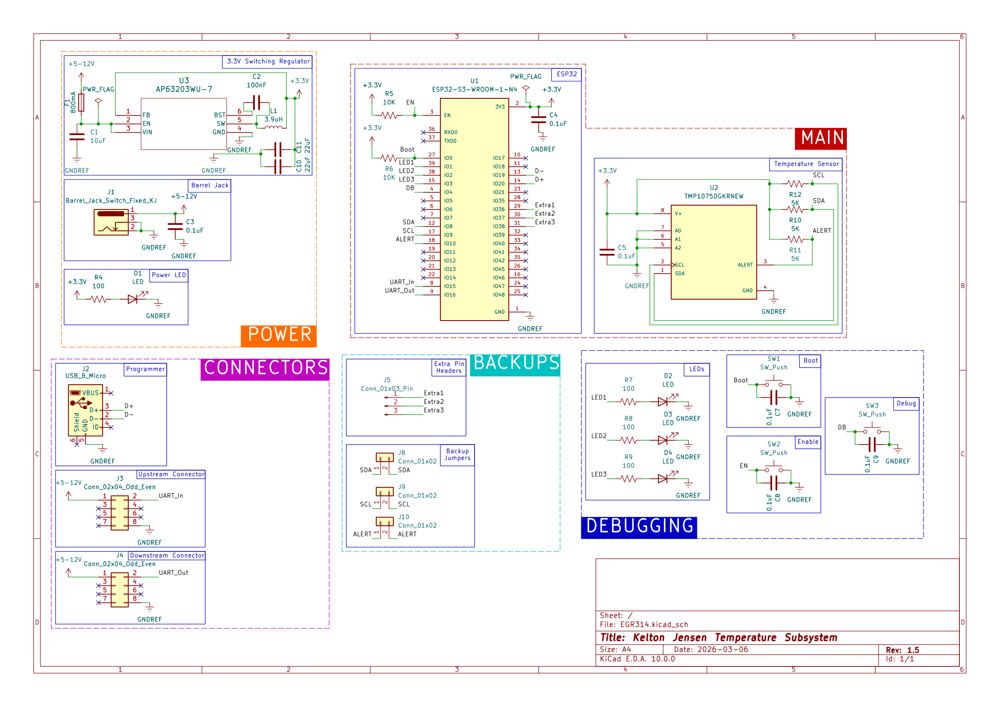

## Overview

This schematic is designed to control a temperature sensor. It has additional functions such as debugging LEDs and buttons as well as extra headers.

## Resouces

The schematic as a PDF download is available [*here*](EGR314Schematic.pdf), and the Zip folder of the project [*here*](EGR314.zip).
