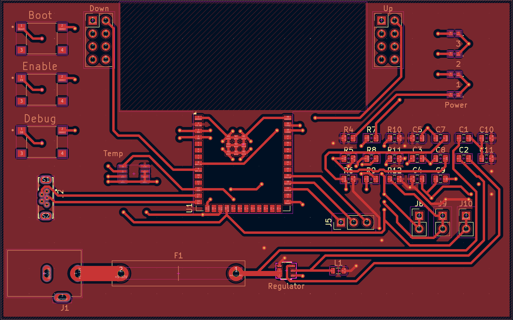
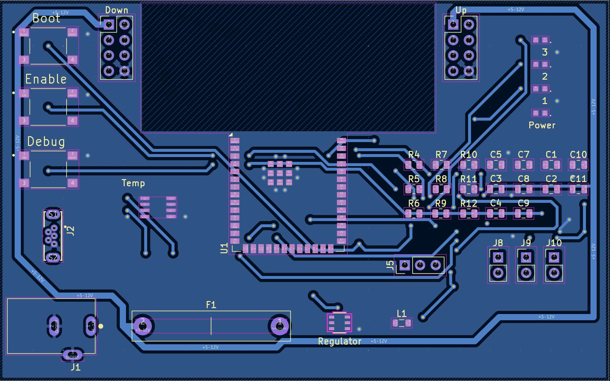

## PCB
Below are images of my top and bottom layers of the design of my PCB.

## Top

## Bottom

## PCB Top (No components)

## PCB Bottom (No components)

## PCB Top (With components)

## PCB Bottom (With components)

-----------------------------
You can view the top and bottom layers as a PDF [here](PCBTop-combined.pdf), you can also view the Gerber and drill files [here](gerberKJ314.zip), and you can also view the zip file of the project [here](EGR314.zip).
